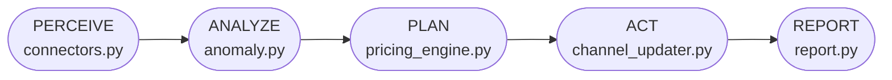

# Revenue Pilot — Complete System Architecture

> A full-stack revenue management system composed of a five-stage Python agent pipeline, a Flask/Gunicorn web service, and a glassmorphism SaaS dashboard.

---

## 1. Top-Level System Map

```
┌──────────────────────────────────────────────────────────────────────────────┐
│                              EXTERNAL DATA SOURCES                           │
│  bookings.csv  │  competitor_rates.csv  │  events.json  │  occupancy_history │
└───────┬─────────────────┬───────────────────┬──────────────────┬─────────────┘
        │                 │                   │                  │
        ▼                 ▼                   ▼                  ▼
┌──────────────────────────────────────────────────────────────────────────────┐
│                      Cloudflare Workers AI (REST API)                        │
└─────────────────────────────────────┬────────────────────────────────────────┘
                                      │
                                      ▼
┌──────────────────────────────────────────────────────────────────────────────┐
│                         src/  (Python Agent Pipeline)                        │
│                                                                              │
│  connectors.py ──► agent.py ──► anomaly.py ──► pricing_engine.py            │
│                       │                              │                       │
│                       ▼                              ▼                       │
│               channel_updater.py               report.py                     │
└─────────────────────────────┬────────────────────────────────────────────────┘
                              │  result dict
                              ▼
┌──────────────────────────────────────────────────────────────────────────────┐
│                          app.py  (Flask / Gunicorn)                          │
│                                                                              │
│  GET  /               → render_template(index.html)                          │
│  GET  /api/data        → serialize_result() → JSON                           │
│  POST /api/run         → re-run agent, return fresh JSON                     │
│  POST /api/override/approve → push one date manually to channels             │
│  POST /api/override/dismiss → clear date from held-back list                 │
│  GET  /healthz         → {"status": "ok"}                                   │
└─────────────────────────────┬────────────────────────────────────────────────┘
                              │  HTTP
                              ▼
┌──────────────────────────────────────────────────────────────────────────────┐
│              static/  +  templates/  (Browser Dashboard)                     │
│                                                                              │
│  index.html      → Semantic HTML5 shell, Chart.js CDN                        │
│  dashboard.css   → Design system (tokens, glassmorphism, animations)         │
│  dashboard.js    → Fetch /api/data, render KPIs / chart / tables             │
│                    handleApprove() / handleDismiss() → override APIs         │
└──────────────────────────────────────────────────────────────────────────────┘
                              │  Ingress (Traefik port 80 → K8s Service)
                              ▼
┌──────────────────────────────────────────────────────────────────────────────┐
│                  Infrastructure (SUSE Rancher K3s on Vultr)                  │
│                                                                              │
│  Traefik ──► revenue-agent-service ──► revenue-agent Deployment (2 replicas) │
│                                         (Gunicorn → Flask in Container)      │
│  Secrets: cloudflare-secrets (K8s Secret) injected as Env Vars               │
└──────────────────────────────────────────────────────────────────────────────┘
```

---

## 2. The Five-Stage Agent Pipeline

Every agent run (`agent.py::RevenueManagementAgent.run()`) executes five sequential stages. Each stage calls a distinct module with no shared global state.



### Stage 1 — PERCEIVE (`src/connectors.py`)

Thin adapter layer. Each connector exposes a `fetch()` method; swapping a CSV reader for a PMS API call requires only changing the connector's internals — the orchestrator never changes.

| Class | Input | Output | Production swap |
|---|---|---|---|
| `BookingDataConnector` | `bookings.csv` | `List[BookingRecord]` | Opera / Mews / Cloudbeds PMS API |
| `CompetitorPricingConnector` | `competitor_rates.csv` | `List[CompetitorRate]` + `market_index_by_date()` | RateGain / OTA Insight |
| `EventCalendarConnector` | `events.json` | `List[EventRecord]` + `impact_by_date()` (date-expanded lookup) | PredictHQ / Ticketmaster / convention bureau |
| `OccupancyHistoryConnector` | `occupancy_history.csv` | `by_current_date(stay_date)` → 364-day lookback | Data warehouse / BI store |

**Key data structures:**
```python
BookingRecord:  stay_date, bookings_on_the_books, rooms_available,
                current_adr, avg_length_of_stay, pickup_last_7d
                → occupancy_pct (computed property)

CompetitorRate: stay_date, competitor, rate, source
EventRecord:    event, start_date, end_date, expected_attendance,
                demand_impact ("high"|"medium"|"low"), source
OccupancyHistoryRecord: stay_date_ly, occupancy_pct_ly, adr_ly, revpar_ly
```

---

### Stage 2 — ANALYZE (`src/anomaly.py`)

Runs two independent anomaly checks per stay date against dynamic baselines. Does **not** use static thresholds — both baselines are computed from the live dataset each cycle.

#### Check 1: Pickup Velocity Anomaly
Compares each date's 7-day pickup to the **mean pickup across the entire current dataset**:

$$\Delta\%_{\text{pickup}} = 100 \times \frac{P_{\text{date}} - \bar{P}_{\text{dataset}}}{\bar{P}_{\text{dataset}}}$$

#### Check 2: Year-over-Year Occupancy
Aligns each stay date with the same day-of-week last year (364-day offset) and computes the occupancy deviation:

$$\Delta\%_{\text{YoY}} = 100 \times \frac{\text{Occ}_{\text{current}} - \text{Occ}_{\text{LY}}}{\text{Occ}_{\text{LY}}}$$

#### Severity Classification
| Threshold | Severity | Action |
|---|---|---|
| $|\Delta\%| < 60\%$ | `info` | Not surfaced |
| $|\Delta\%| \geq 60\%$ | `watch` | Shown on dashboard, auto-push proceeds |
| $|\Delta\%| \geq 120\%$ | `critical` | Shown in red, **auto-push blocked**, held for human review |

Results are returned sorted by `abs(delta_pct)` descending — highest severity first.

---

### Stage 3 — PLAN (`src/pricing_engine.py`)

Computes one `RateRecommendation` per stay date. The formula is deterministic and every step produces a plain-English rationale string so a revenue manager can audit the logic.

#### Rate Formula

$$\text{Target} = \text{ADR}_{\text{current}} \times F_{\text{occ}} \times F_{\text{pace}} \times F_{\text{event}}$$

| Factor | Input signal | Scale |
|---|---|---|
| $F_{\text{occ}}$ | Occupancy % on the books | `0.90` → `1.12` across 6 bands |
| $F_{\text{pace}}$ | 7-day room pickup | `0.97` → `1.08` across 4 bands |
| $F_{\text{event}}$ | Event demand_impact | `1.00` / `1.07` / `1.15` |

#### Competitive Blending (when comp data exists)
$$\text{Blended} = 0.7 \times \text{Target} + 0.3 \times \text{CompSetAverage}$$

#### Guardrails (applied in sequence)
1. **Cycle cap**: result clamped to `ADR × (1 ± 0.15)` — max ±15% per cycle
2. **Absolute floor/ceiling**: `$120.00` ≤ rate ≤ `$320.00`

Every clamping action appends a rationale line explaining the adjustment.

---

### Stage 4 — ACT (`src/channel_updater.py`)

Pushes approved rates to the four distribution channels. Critical-anomaly dates are intercepted before this stage unless `auto_push_critical_anomalies=True`.

```python
# Interlock in agent.py
push_dates = {
    r.stay_date: r.recommended_rate
    for r in recommendations
    if r.stay_date not in critical_dates or self.auto_push_critical_anomalies
}
```

| Channel | Current impl | Production swap |
|---|---|---|
| Direct Booking Engine | Simulated (~5% failure rate) | Hotel website booking engine API |
| Booking.com | Simulated | Channel manager API (SiteMinder, RateGain) |
| Expedia | Simulated | Channel manager API |
| GDS | Simulated | Amadeus / Sabre GDS connection |

`push_rate()` returns a `ChannelUpdateResult` with `status="success"\|"failed"`. Failed pushes are surfaced in the dashboard and brief as "queued for retry."

---

### Stage 5 — REPORT (`src/report.py`)

Assembles the human-readable `Revenue Strategy Brief` as a Markdown document. Sections:
1. **AI Market Commentary**: Generates a 2-3 sentence narrative summary using the **Cloudflare Workers AI REST API** (`@cf/meta/llama-3.1-8b-instruct`), explaining the primary drivers behind the rate decisions.
2. Executive Summary (headline numbers)
3. Rate Recommendations table + full per-date rationale
4. Demand Anomalies log
5. Channel Distribution Log
6. Cited Market Intelligence (competitor rates + events, each with source citation)

The same data is also serialized to JSON by `app.py::serialize_result()` for the dashboard.

---

## 3. Web Application Layer (`app.py`)

Flask/Gunicorn WSGI app wrapping the agent pipeline. Uses **in-memory caching** — the agent result is held in `_last_result` for the lifetime of the Gunicorn worker process. Re-running the agent (button click or POST to `/api/run`) replaces the cache.

### API Surface

| Route | Method | Purpose |
|---|---|---|
| `/` | GET | Serves `templates/index.html` (the dashboard) |
| `/api/data` | GET | Returns `serialize_result(_last_result)` as JSON |
| `/api/run` | POST | Runs agent, updates cache, returns fresh JSON |
| `/api/override/approve` | POST | Manually pushes one held-back date to all channels |
| `/api/override/dismiss` | POST | Removes a date from `held_back_dates` without pushing |
| `/api/brief` | GET | Returns raw Markdown brief (backward-compatible) |
| `/run` | GET | Browser redirect — runs agent, redirects to `/` |
| `/healthz` | GET | Load-balancer health check → `{"status": "ok"}` |

### `serialize_result()` — JSON Contract

```json
{
  "property_name": "Harborview Grand (Demo)",
  "generated_at": "2026-07-04 14:43",
  "summary": {
    "dates_reviewed": 15, "increases": 9, "decreases": 6, "holds": 0,
    "anomaly_count": 9, "critical_count": 3,
    "channel_success": 43, "channel_total": 48, "channel_failures": 5,
    "revenue_impact": 70.19
  },
  "recommendations": [{ "stay_date", "current_rate", "recommended_rate",
                        "change_pct", "occupancy_pct", "event", "rationale" }],
  "anomalies":      [{ "stay_date", "metric", "current_value", "baseline_value",
                        "delta_pct", "severity", "note" }],
  "channel_results":[{ "stay_date", "channel", "rate_pushed", "status", "detail" }],
  "competitor_rates":[{ "stay_date", "competitor", "rate", "source" }],
  "events":         [{ "event", "start_date", "end_date",
                        "expected_attendance", "demand_impact", "source" }],
  "held_back_dates": ["2026-07-13", "2026-07-17", "2026-07-18"]
}
```

---

## 4. Frontend Dashboard (`static/` + `templates/`)

Zero-build stack — HTML/CSS/JS served directly by Flask. Chart.js loaded from CDN.

### Rendering Flow
```
DOMContentLoaded
  └── fetchDashboardData() → GET /api/data
        └── renderAll(data)
              ├── renderKPICards()         → animated counters, progress ring
              ├── renderRateChart()        → Chart.js grouped bar (current vs. recommended)
              ├── renderAnomalies()        → anomaly cards w/ Approve/Dismiss buttons for critical
              ├── renderEvents()           → event cards with impact dots
              ├── renderChannels()         → status table with success/failed icons
              └── renderMarketIntel()      → competitor rate citations, event citations
```

### Interactive Override Flow
```
User clicks "Approve & Push ($258.75)" on 2026-07-18
  └── confirm() dialog
        └── POST /api/override/approve  {stay_date, rate}
              └── agent.channel_updater.push_all(stay_date, rate)
                    └── Updates _last_result cache
                          └── fetchDashboardData() → UI refreshes
```

### Design System (`dashboard.css`)
- CSS custom properties for all colors, spacing, radii, shadows
- Glassmorphism cards (`backdrop-filter: blur(12px)`, semi-transparent backgrounds)
- `fadeUp` keyframe animation with staggered delays for cards
- Severity color tokens: `--accent-red` (critical), `--accent-amber` (watch), `--accent-teal` (positive)
- Fully responsive: 4-column KPI grid → 2-column → 1-column at breakpoints

---

## 5. Infrastructure & Deployment (SUSE Rancher K3s)

The application is deployed on a Vultr Ubuntu 24.04 VM (95.179.209.105) running a single-node **SUSE Rancher K3s** Kubernetes cluster.

```
Vultr Ubuntu 24.04 VM (K3s Node)
│
├── Kubernetes Resources
│   ├── namespace: default
│   ├── deployment/revenue-agent (2 replicas)
│   ├── service/revenue-agent-service (ClusterIP)
│   ├── ingress/revenue-agent-ingress (Traefik routing port 80 → Service)
│   └── secret/cloudflare-secrets (Env vars for Cloudflare AI)
│
└── /home/deploy/revenue_agent/
    ├── k8s/                (Manifests: deployment, service, ingress)
    ├── src/                (pipeline modules)
    ├── data/               (CSV/JSON sample data)
    ├── static/             (CSS + JS)
    ├── templates/          (Jinja2 HTML)
    ├── app.py              (Flask entrypoint)
    ├── Dockerfile          (Container build spec)
    └── DEPLOY.md           (Deployment guide)
```

**Deployment Cycle (Container-Native):**
```bash
# 1. Pull latest code on the server
git pull

# 2. Build the Docker image locally
sudo docker build -t revenue-agent:latest .

# 3. Import image into K3s containerd (avoiding public registry)
sudo docker save revenue-agent:latest | sudo k3s ctr images import -

# 4. Rollout the deployment
sudo KUBECONFIG=/etc/rancher/k3s/k3s.yaml kubectl rollout restart deployment revenue-agent
```

---

## 6. Memory & State Model

| Layer | State | Lifetime |
|---|---|---|
| Agent pipeline | Stateless — reads files, returns dict | Per-run (milliseconds) |
| `_last_result` cache | In-memory dict in Gunicorn worker | Until next `/api/run` call or Pod restart. **Note:** With 2 replicas, manual refreshes might hit different pods. In production, swap for Redis. |
| Historical baselines | `occupancy_history.csv` read fresh each run | Per-run |
| YoY lookback window | 364 days (same weekday alignment) | Hardcoded in `OccupancyHistoryConnector` |
| Override state | In `_last_result["held_back_dates"]` list | Until next agent re-run |
| Brief file | `revenue_strategy_brief.md` on pod disk | Ephemeral to the Pod's lifecycle |

---

## 7. Extension Map

| Goal | File to change | What to change |
|---|---|---|
| Plug in a real PMS | `src/connectors.py` | `BookingDataConnector.fetch()` body |
| Plug in real competitor data | `src/connectors.py` | `CompetitorPricingConnector.fetch()` |
| Real channel manager push | `src/channel_updater.py` | `push_rate()` body → real API call |
| Tighten anomaly sensitivity | `src/anomaly.py` | `AnomalyDetector(watch_threshold=40, critical_threshold=80)` |
| Different pricing curve | `src/pricing_engine.py` | `_occupancy_factor()`, `_pace_factor()`, `_event_factor()` lookup tables |
| Add a new dashboard panel | `app.py` + `dashboard.js` | Extend `serialize_result()`, add renderer function |
| New domain (e.g., car rentals) | `src/connectors.py` | Redefine "occupancy" and field names; keep pipeline structure |
| Persistent DB instead of CSV | `src/connectors.py` | Swap `csv.DictReader` for SQLAlchemy / psycopg2 queries |
| ML pricing model | `src/pricing_engine.py` | Drop in behind the same `recommend()` interface |
